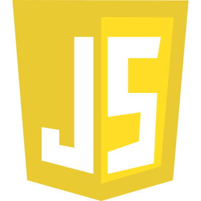
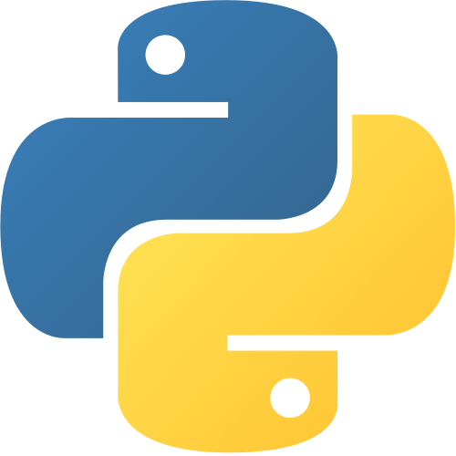
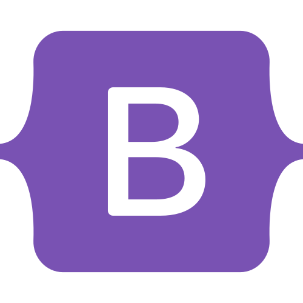
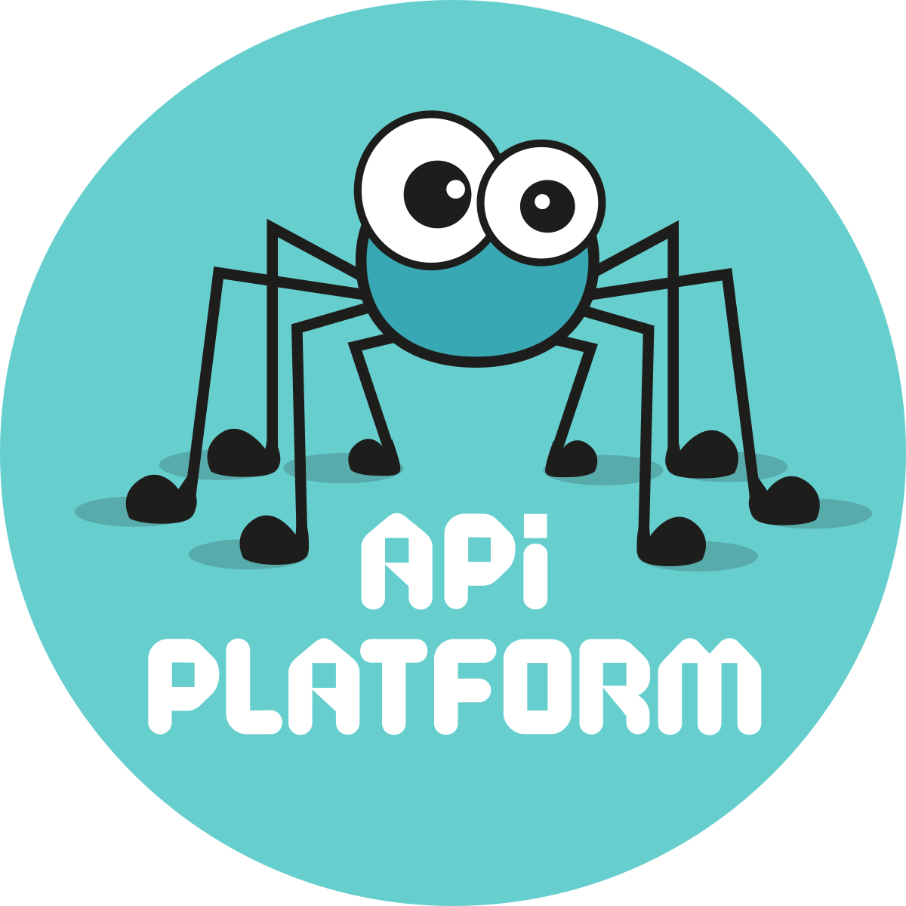
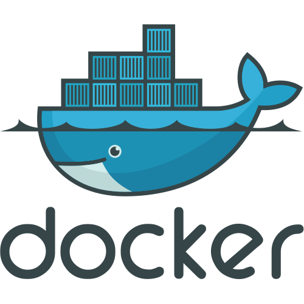

 
# 👋 Bienvenu sur mon Githug
 
<!-- 
## 🚀 Stack principale

- **Langages :** PHP, TypeScript 
- **Backend :** Symfony, API Platform
- **Frontend :** Nuxt, TailwindCSS  
- **Base de données :** MySQL  
- **Environnement :** Docker, GitHub, Linux/Windows   -->

## 🧩 Mes Stack technique
---
### 🔧 Langages
<table>
<tr>
<td align="center"> PHP</td>
<td align="center"> TypeScript</td>
<td align="center"> HTML5</td>
<td align="center"> JavaScript</td>
<!-- <td align="center"> Python</td> -->
</tr>
</table>

---
 
### 🔧 Pour le design

<table>
<tr>
<td align="center"> Tailwind CSS</td> 
<td align="center"> CSS3</td>
<td align="center"> Bootstrap 5</td>
<td align="center"> Sass</td>
</tr>
</table>

---

### 🔧 Backend

<table>
<tr>
 
<td align="center" bgcolor="white"> Symfony</td>
<td align="center"> API Platform</td>
<td align="center"> Nitro</td>
<td align="center"> Node.js</td>
<!-- <td align="center"> FastAPI</td> -->
</tr>
</table>

---

### 🎨 Frontend

<table>
<tr>
<td align="center"> Angular</td>
<td align="center"> Nuxt</td>
<td align="center"> Vue</td>
</tr>
</table>

---

### 🛢️ Bases de données

<table>
<tr>
<td align="center"> MySQL</td>
<!-- <td bgcolor="white" align="center"></td> -->
<!-- <td align="center"> MongoDB</td> -->
</tr>
</table>

---

### 🧰 Outils & Écosystème

<table>
<tr>
<td align="center"> Git</td>
<td bgcolor="white" align="center"> GitHub</td>
<td align="center"> Docker</td>
<td align="center"> VS Code</td>
<!-- <td align="center"> Linux</td>
<td align="center"> WordPress</td>
<td align="center"> Figma</td>
<td align="center"> LinkedIn</td> -->
</tr>
</table>

<!-- ---

## 📌 Projets mis en avant

### 🔹 **portofolioAngular**  
> Portfolio moderne en Angular  
[➡️ Voir le projet](https://github.com/kurtounet/portofolioAngular)

### 🔹 **loc-car-api**  
> API PHP pour gestion de location automobile  
[➡️ Voir le projet](https://github.com/kurtounet/loc-car-api)

### 🔹 **projetsymfony**  
> Projet Symfony complet (MVC, routes, templating)  
[➡️ Voir le projet](https://github.com/kurtounet/projetsymfony)

### 🔹 **wheather-app-simplon**  
> Application météo simple en JavaScript  
[➡️ Voir le projet](https://github.com/kurtounet/wheather-app-simplon)

---

## 📈 Stats GitHub

  
  

--- -->

<!-- ## 📬 Me contacter -->

<!-- - 🌍 Site : https://ab-web.fr   -->
<!-- - 📧 Email : *(ajoute-le si tu veux)*   -->
<!-- - 📦 GitHub : **@kurtounet** -->

---

## 👋 Merci d’être passé sur mon profil !
